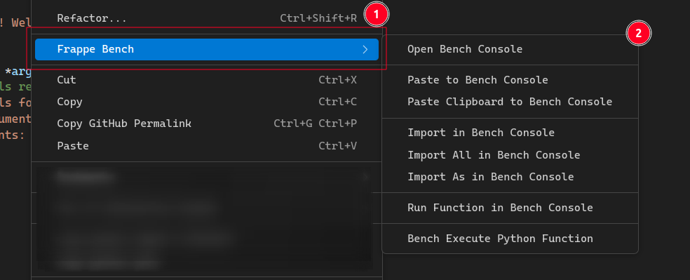
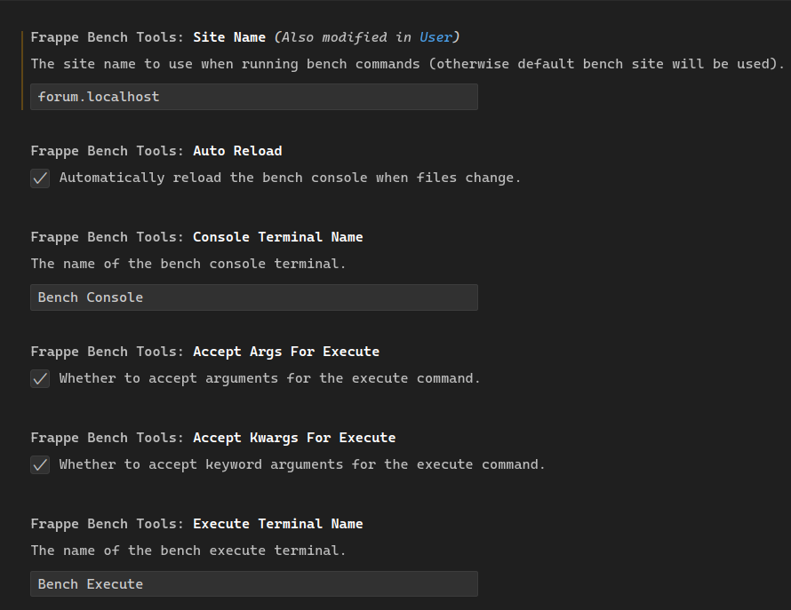

<div align="center">
  
    <h2>Frappe Bench Tools</h2>
</div>

- Use Frappe Bench commands directly from VS Code to enhance your Frappe development workflow.  

- This extension provides quick access to the Frappe Bench console, imports, and execution utilities.

## 📑 Table of Contents

- [Features](#features)
- [Prerequisites](#prerequisites)
- [Installation](#installation)
- [Configuration](#configuration)
- [Commands](#commands)
- [Troubleshooting](#troubleshooting)
- [Contributing](#contributing)
- [License](#license)
- [Support](#support)

## Features

### 🧭 Open Bench Console

Open or switch to a Frappe Bench console terminal directly from VS Code.


### 📋 Paste to Bench Console

- Paste selected code directly into the Bench console.  
- If no selection, paste the current line where the cursor is located.


### 📄 Paste Clipboard to Bench Console

Paste content directly from the clipboard to the Bench console.


### 📦 Import in Bench Console

Import functions, classes, or variables by placing the cursor on them.


### 🌐 Import All in Bench Console

Import all exports from a module using:

```py
from module import *
```


### 🏷️ Import As in Bench Console

Import with a custom alias — prompted for an alias name.


### ⚡ Run Function in Bench Console

Automatically import and execute a function by placing the cursor on its definition.


### 🧩 Bench Execute Python Function

Execute a Python function using:

```bash
bench --site <site> execute <path.to.function>
```

- Optionally provide `args` and `kwargs` interactively.
- Perfect for testing patches.


### 🖱️ Context Menu Integration

Access all features through a dedicated **“Frappe Bench”** submenu in the right-click context menu.



## Prerequisites

Before using the extension, make sure you have the following:

### Required

1. **VS Code Extension** – [Copy Python Path](https://marketplace.visualstudio.com/items?itemName=kawamataryo.copy-python-dotted-path)
   Used to generate Python import statements automatically.

2. **Frappe Bench Environment**

   - You must have a working Frappe Bench setup.
   - The `bench` command should be available in your system PATH.

3. **Single App Workspace**

   - Open your Frappe app as a **single workspace** in VS Code for correct module path resolution.

## Installation

### From VS Code Marketplace

1. Open VS Code.
2. Go to **Extensions** (<kbd>Ctrl</kbd>+<kbd>Shift</kbd>+<kbd>X</kbd> or <kbd>Cmd</kbd>+<kbd>Shift</kbd>+<kbd>X</kbd>).
3. Search for **"Frappe Bench Tools"**.
4. Click **Install**.

### From Command Line

```bash
code --install-extension abdeali.frappe-bench-tools
```

## Configuration

Configure the extension from VS Code settings (<kbd>Ctrl</kbd>+<kbd>,</kbd> or <kbd>Cmd</kbd>+<kbd>,</kbd>).

### 🧱 General Settings

#### `frappeBenchTools.siteName`

- **Type**: `string`
- **Default**: `"frappe.localhost"`
- **Description**: Site name for running Bench commands.

**Example:**

```json
{
  "frappeBenchTools.siteName": "my-site.localhost"
}
```

### 💻 Console Settings

#### `frappeBenchTools.consoleTerminalName`

- **Type**: `string`
- **Default**: `"Bench Console"`
- **Description**: Terminal name for console operations.

#### `frappeBenchTools.autoReload`

- **Type**: `boolean`
- **Default**: `true`
- **Description**: Use `--autoreload` to auto-reload the console on file changes.

**Example:**

```json
{
  "frappeBenchTools.consoleTerminalName": "My Frappe Console",
  "frappeBenchTools.autoReload": true
}
```

### ⚙️ Execute Settings

#### `frappeBenchTools.executeTerminalName`

- **Type**: `string`
- **Default**: `"Bench Execute"`
- **Description**: Terminal name for bench execute operations.

#### `frappeBenchTools.acceptArgsForExecute`

- **Type**: `boolean`
- **Default**: `true`
- **Description**: Prompt for list arguments, e.g., `["arg1", "arg2"]`.

#### `frappeBenchTools.acceptKwargsForExecute`

- **Type**: `boolean`
- **Default**: `true`
- **Description**: Prompt for dictionary kwargs, e.g., `{"key": "value"}`.

**Example:**

```json
{
  "frappeBenchTools.executeTerminalName": "Frappe Executor",
  "frappeBenchTools.acceptArgsForExecute": true,
  "frappeBenchTools.acceptKwargsForExecute": true
}
```



## Commands

All commands are available from the **Command Palette** (<kbd>Ctrl</kbd>+<kbd>Shift</kbd>+<kbd>P</kbd> / <kbd>Cmd</kbd>+<kbd>Shift</kbd>+<kbd>P</kbd>):

| Command                            | Description                                    |
|------------------------------------|------------------------------------------------|
| `Open Bench Console`               | Open or switch to the bench console terminal   |
| `Paste to Bench Console`           | Paste selected text or current line to console |
| `Paste Clipboard to Bench Console` | Paste clipboard content to console             |
| `Import in Bench Console`          | Generate and execute import statement          |
| `Import All in Bench Console`      | Import all exports from module                 |
| `Import As in Bench Console`       | Import with custom alias                       |
| `Run Function in Bench Console`    | Import and execute function                    |
| `Bench Execute Python Function`    | Execute function using bench execute command   |

## Troubleshooting

### ⚠️ “Copy Python Path extension is not installed”

Install the dependency: [Copy Python Path](https://marketplace.visualstudio.com/items?itemName=kawamataryo.copy-python-dotted-path)

### 💥 Terminal not responding

Close the terminal and re-run the command — a new terminal will be created automatically.

### 🧩 Import statements not working

Ensure your Python files are inside a valid Frappe app structure with correct module paths.

### 🎯 Import not detecting object

Place the cursor exactly on the **function, class, or variable** name before running the import or run commands.

## Contributing

Contributions are welcome!
Feel free to submit a **Pull Request** or open an **Issue** on GitHub.

## License

Licensed under the [MIT License](LICENSE).

## Support

For issues, suggestions, or feature requests —
visit the [GitHub repository](https://github.com/Abdeali099/frappe-bench-tools).
