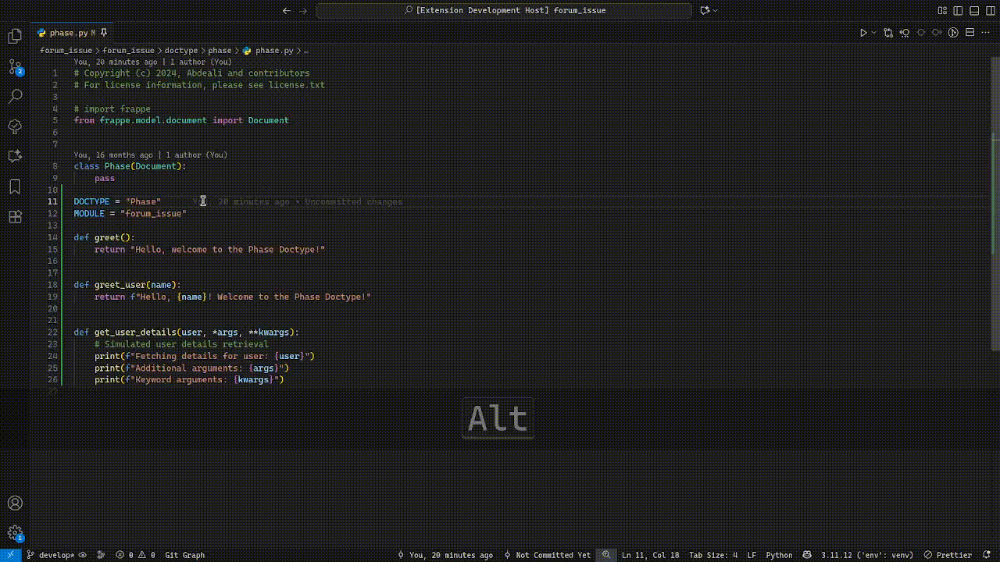
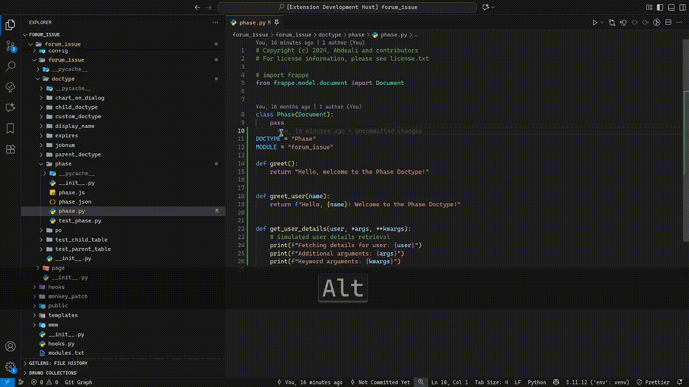
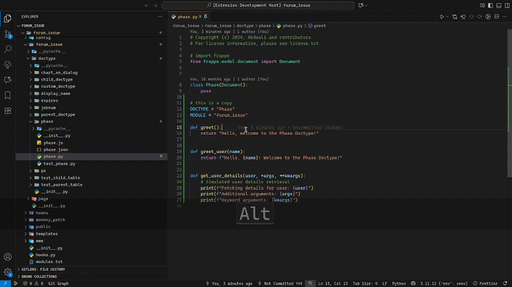
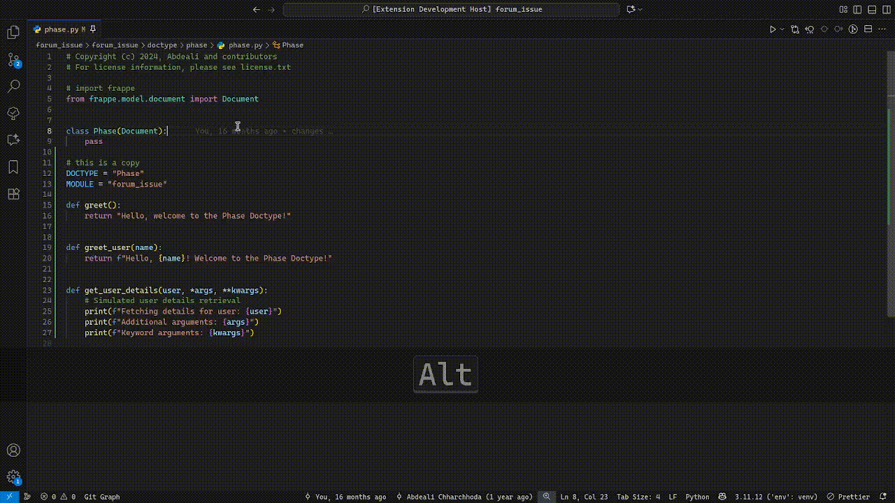
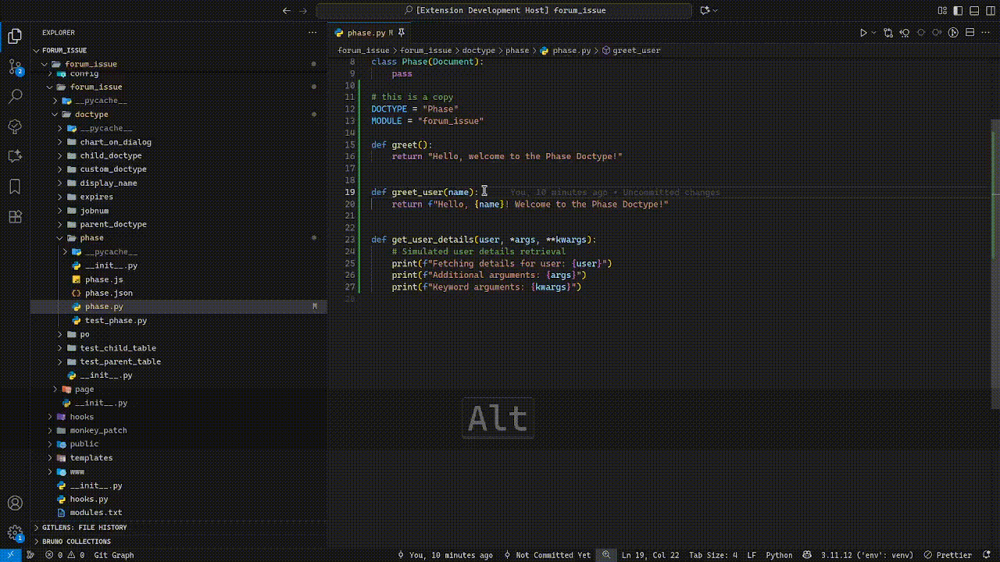
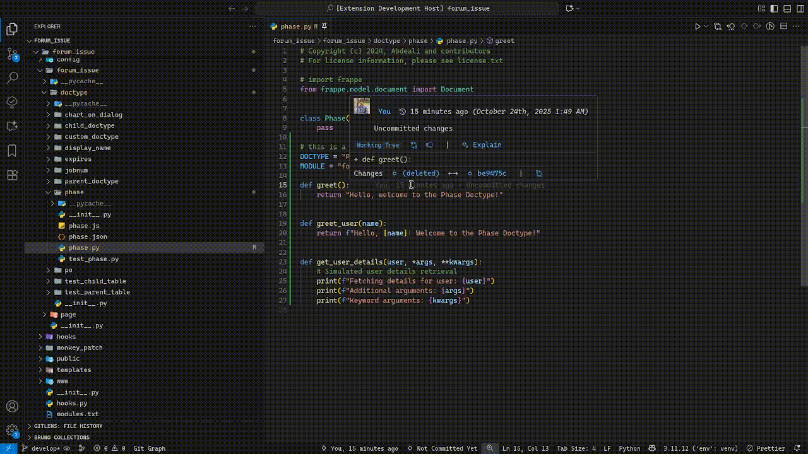
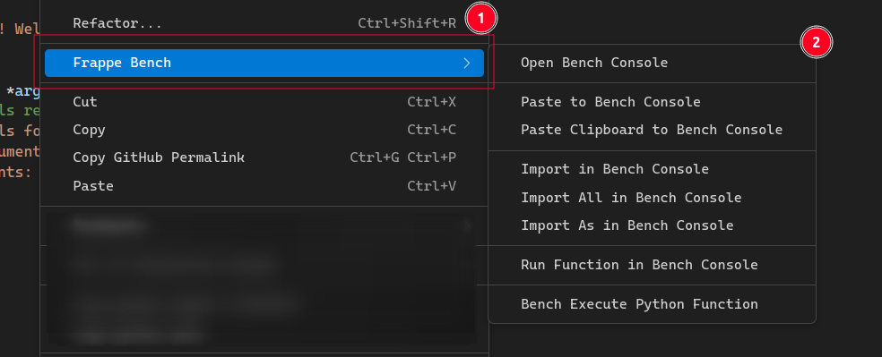
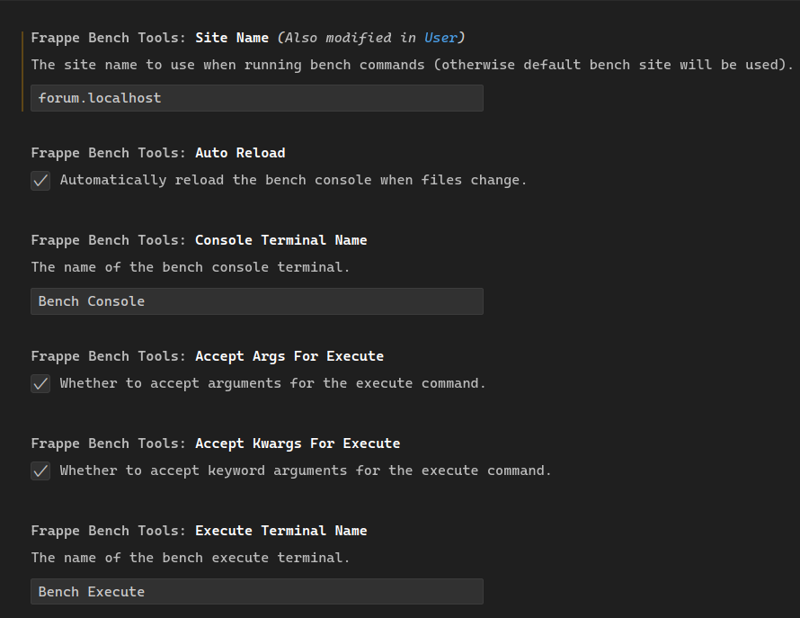

<div align="center">
  
    <h2>Frappe Bench Tools</h2>
</div>

- Use Frappe Bench commands directly from VS Code to enhance your Frappe development workflow.  

- This extension provides quick access to the Frappe Bench console, imports, and execution utilities.

## 📑 Table of Contents

- [Features](#features)
- [Prerequisites](#prerequisites)
- [Installation](#installation)
- [Configuration](#configuration)
- [Commands](#commands)
- [Troubleshooting](#troubleshooting)
- [Contributing](#contributing)
- [License](#license)
- [Support](#support)

## Features

### 🧭 Open Bench Console

Open or switch to a Frappe Bench console terminal directly from VS Code.



### 📋 Paste to Bench Console

- Paste selected code directly into the Bench console.  
- If no selection, paste the current line where the cursor is located.


### 📄 Paste Clipboard to Bench Console

Paste content directly from the clipboard to the Bench console.



### 📦 Import in Bench Console

Import functions, classes, or variables by placing the cursor on them.



### 🌐 Import All in Bench Console

Import all exports from a module using:

```py
from module import *
```



### 🏷️ Import As in Bench Console

Import with a custom alias — prompted for an alias name.



### ⚡ Run Function in Bench Console

Automatically import and execute a function by placing the cursor on its definition.



### 🧩 Bench Execute Python Function

Execute a Python function using:

```bash
bench --site <site> execute <path.to.function>
```

- Optionally provide `args` and `kwargs` interactively.
- Perfect for testing patches.


### ♻️ Recreate Custom Fields

Deletes every `Custom Field` record on a site and creates them again by running the setup functions of your app:

```bash
bench --site <site> execute 'frappe.db.delete("Custom Field")' && bench --site <site> clear-cache && bench --site <site> execute <path.to.after_install>
```

- Prompts for the site name, pre-filled with `siteName`.
- Runs the functions configured in `recreateCustomFieldsMethods`, in order.
- Everything is chained with `&&`, so the steps run one after another and stop at the first failure.
- Asks for confirmation first, since the delete is destructive.
- Perfect for picking up renamed, reordered or removed custom fields without reinstalling the app.

### 🛠️ Custom Commands

Save the commands you run over and over, and pick them from a list instead of retyping them.

- **Create Custom Command** — prompts for a name and the command, then saves it to your settings.
- **Run Custom Command** — pick a saved command by name (type to filter) and it runs in its own terminal.

Commands can use placeholders, filled in from the settings when the command runs:

| Placeholder | Filled in from |
|---|---|
| `{site}` | `frappeBenchTools.siteName` |
| `{app}` | `frappeBenchTools.defaultApp` |
| `{bench}` | the bench found in your workspace folders |
| `{appPath}` | the directory of `defaultApp`, found in your workspace folders |

So `bench --site {site} migrate` runs as `bench --site my-site.localhost migrate`.

`{bench}` and `{appPath}` are not configured, they are searched for, so that commands never depend on where the terminal happens to be opened:

- `{bench}` walks each workspace folder up until one holds `sites/apps.txt`.
- `{appPath}` searches the workspace folders breadth first for a directory named after the app, so the app itself is found before the python package of the same name inside it. Apps kept outside `apps/` are found just as well.

The terminal is opened at the bench for the same reason, since `bench` commands do not run from an app folder.

One command is available out of the box, to bring an app up to date:

```bash
git -C {appPath} pull && bench setup requirements && bench build --app {app} && bench migrate
```

The picker shows the command with its placeholders already filled in, so you always see exactly what will run. Saved commands live in `frappeBenchTools.customCommands`, so they can be edited or removed from the settings like any other setting.

### 🖱️ Context Menu Integration

Access all features through a dedicated **“Frappe Bench”** submenu in the right-click context menu.



## Prerequisites

Before using the extension, make sure you have the following:

### Required

1. **VS Code Extension** – [Copy Python Path](https://marketplace.visualstudio.com/items?itemName=kawamataryo.copy-python-dotted-path)
   Used to generate Python import statements automatically.

2. **Frappe Bench Environment**

   - You must have a working Frappe Bench setup.
   - The `bench` command should be available in your system PATH.

3. **Single App Workspace**

   - Open your Frappe app as a **single workspace** in VS Code for correct module path resolution.

## Installation

### From VS Code Marketplace

1. Open VS Code.
2. Go to **Extensions** (<kbd>Ctrl</kbd>+<kbd>Shift</kbd>+<kbd>X</kbd> or <kbd>Cmd</kbd>+<kbd>Shift</kbd>+<kbd>X</kbd>).
3. Search for **"Frappe Bench Tools"**.
4. Click **Install**.

- Visual Studio Marketplace: [Frappe Bench Tools](https://marketplace.visualstudio.com/items?itemName=abdeali.frappe-bench-tools)

### From Command Line

```bash
code --install-extension abdeali.frappe-bench-tools
```

## Configuration

Configure the extension from VS Code settings (<kbd>Ctrl</kbd>+<kbd>,</kbd> or <kbd>Cmd</kbd>+<kbd>,</kbd>).

### 🧱 General Settings

#### `frappeBenchTools.siteName`

- **Type**: `string`
- **Default**: `"frappe.localhost"`
- **Description**: Site name for running Bench commands.

#### `frappeBenchTools.defaultApp`

- **Type**: `string`
- **Default**: `"frappe"`
- **Description**: App name used to fill the `{app}` placeholder of custom commands.

**Example:**

```json
{
  "frappeBenchTools.siteName": "my-site.localhost",
  "frappeBenchTools.defaultApp": "erpnext"
}
```

### 💻 Console Settings

#### `frappeBenchTools.consoleTerminalName`

- **Type**: `string`
- **Default**: `"Bench Console"`
- **Description**: Terminal name for console operations.

#### `frappeBenchTools.autoReload`

- **Type**: `boolean`
- **Default**: `true`
- **Description**: Use `--autoreload` to auto-reload the console on file changes.

**Example:**

```json
{
  "frappeBenchTools.consoleTerminalName": "My Frappe Console",
  "frappeBenchTools.autoReload": true
}
```

### ⚙️ Execute Settings

#### `frappeBenchTools.executeTerminalName`

- **Type**: `string`
- **Default**: `"Bench Execute"`
- **Description**: Terminal name for bench execute operations.

#### `frappeBenchTools.acceptArgsForExecute`

- **Type**: `boolean`
- **Default**: `true`
- **Description**: Prompt for list arguments, e.g., `["arg1", "arg2"]`.

#### `frappeBenchTools.acceptKwargsForExecute`

- **Type**: `boolean`
- **Default**: `true`
- **Description**: Prompt for dictionary kwargs, e.g., `{"key": "value"}`.

**Example:**

```json
{
  "frappeBenchTools.executeTerminalName": "Frappe Executor",
  "frappeBenchTools.acceptArgsForExecute": true,
  "frappeBenchTools.acceptKwargsForExecute": true
}
```

### Recreate Custom Fields Settings

#### `frappeBenchTools.recreateCustomFieldsMethods`

- **Type**: `string[]`
- **Default**: `[]`
- **Description**: Dotted paths of the functions that create your custom fields, executed in order. The command does nothing until this is set.

#### `frappeBenchTools.acceptSiteForRecreate`

- **Type**: `boolean`
- **Default**: `true`
- **Description**: Prompt for the site name, pre-filled with `siteName`.

#### `frappeBenchTools.confirmRecreateCustomFields`

- **Type**: `boolean`
- **Default**: `true`
- **Description**: Ask for confirmation before deleting all `Custom Field` records.

**Example:**

```json
{
  "frappeBenchTools.recreateCustomFieldsMethods": [
    "my_app.setup.after_install"
  ],
  "frappeBenchTools.acceptSiteForRecreate": true,
  "frappeBenchTools.confirmRecreateCustomFields": true
}
```



### 🛠️ Custom Command Settings

#### `frappeBenchTools.customCommandTerminalName`

- **Type**: `string`
- **Default**: `"Bench Command"`
- **Description**: Terminal name for custom commands.

#### `frappeBenchTools.customCommands`

- **Type**: `object` (command name to command)
- **Description**: The saved commands, using `{site}`, `{app}`, `{bench}` and `{appPath}` as placeholders.

**Example:**

```json
{
  "frappeBenchTools.customCommandTerminalName": "Bench Command",
  "frappeBenchTools.customCommands": {
    "Update App": "git -C {appPath} pull && bench setup requirements && bench build --app {app} && bench migrate",
    "Migrate Site": "bench --site {site} migrate",
    "Run Tests": "bench --site {site} run-tests --app {app}"
  }
}
```


## Commands

All commands are available from the **Command Palette** (<kbd>Ctrl</kbd>+<kbd>Shift</kbd>+<kbd>P</kbd> / <kbd>Cmd</kbd>+<kbd>Shift</kbd>+<kbd>P</kbd>):

| Command                            | Description                                    |
|------------------------------------|------------------------------------------------|
| `Open Bench Console`               | Open or switch to the bench console terminal   |
| `Paste to Bench Console`           | Paste selected text or current line to console |
| `Paste Clipboard to Bench Console` | Paste clipboard content to console             |
| `Import in Bench Console`          | Generate and execute import statement          |
| `Import All in Bench Console`      | Import all exports from module                 |
| `Import As in Bench Console`       | Import with custom alias                       |
| `Run Function in Bench Console`    | Import and execute function                    |
| `Bench Execute Python Function`    | Execute function using bench execute command   |
| `Recreate Custom Fields`           | Delete all custom fields on a site and create them again |
| `Create Custom Command`            | Save a command to run later                    |
| `Run Custom Command`               | Pick a saved command and run it                |

## Troubleshooting

### ⚠️ “Copy Python Path extension is not installed”

Install the dependency: [Copy Python Path](https://marketplace.visualstudio.com/items?itemName=kawamataryo.copy-python-dotted-path)

### 💥 Terminal not responding

Close the terminal and re-run the command — a new terminal will be created automatically.

### 🧩 Import statements not working

Ensure your Python files are inside a valid Frappe app structure with correct module paths.

### 🎯 Import not detecting object

Place the cursor exactly on the **function, class, or variable** name before running the import or run commands.

## Contributing

Contributions are welcome!
Feel free to submit a **Pull Request** or open an **Issue** on GitHub.

## License  

This project is licensed under the MIT License. See the [LICENSE](./LICENSE) file for details.

## Support

For issues, suggestions, or feature requests —
visit the [GitHub repository](https://github.com/Abdeali099/frappe-bench-tools).
